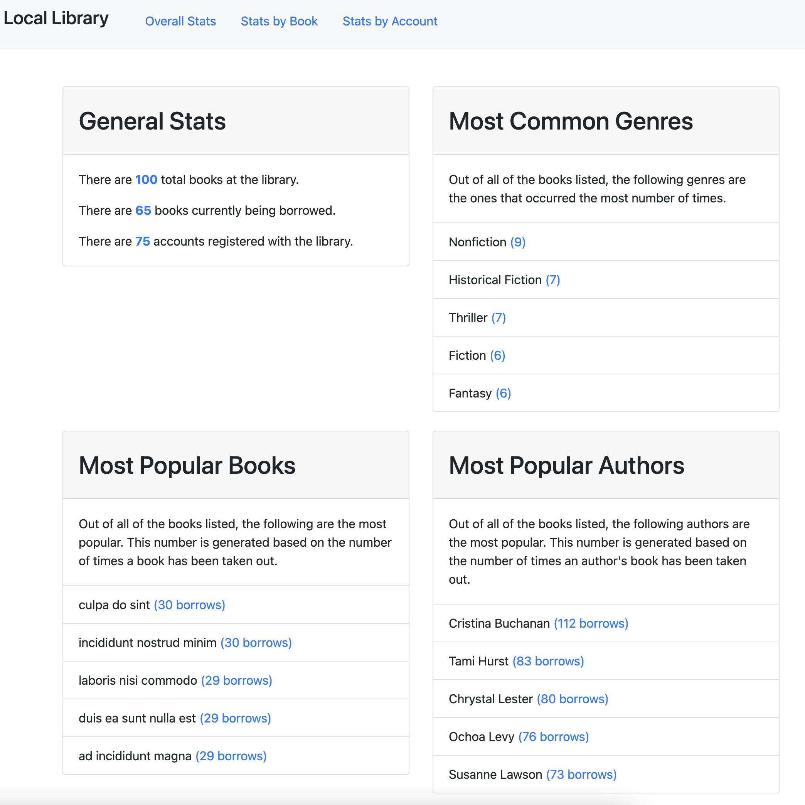

# Local-Library
  
## Description
This is essentially a mock crm of a local book libraby. It contains an main page shocasing different statistics page pertaining to the book store's business, a book/book borrower history log and a borrower account log page where you can navigate and click through different accounts. This app was created to practice the ability to create search algorithms. 
## Contents
* [Usage](#usage)
   * [Screenshots](#screenshots)
* [Built With](#built-with)
* [Questions](#questions)

## Usage
clone this repository to your machine, run npm i then npm start.  
  
### Screenshots

## Built With

* HTML
* CSS
* JavaScript
* Node.js
  
## Questions
If you have any questions about the repo, please [open an issue](https://github.com/Oscarlosg/Local-Libraby/issues) or contact me via email at oscarlosg14@gmail.com. You can find more of my work on my GitHub, [Oscarlosg](https://github.com/Oscarlosg/).
  
